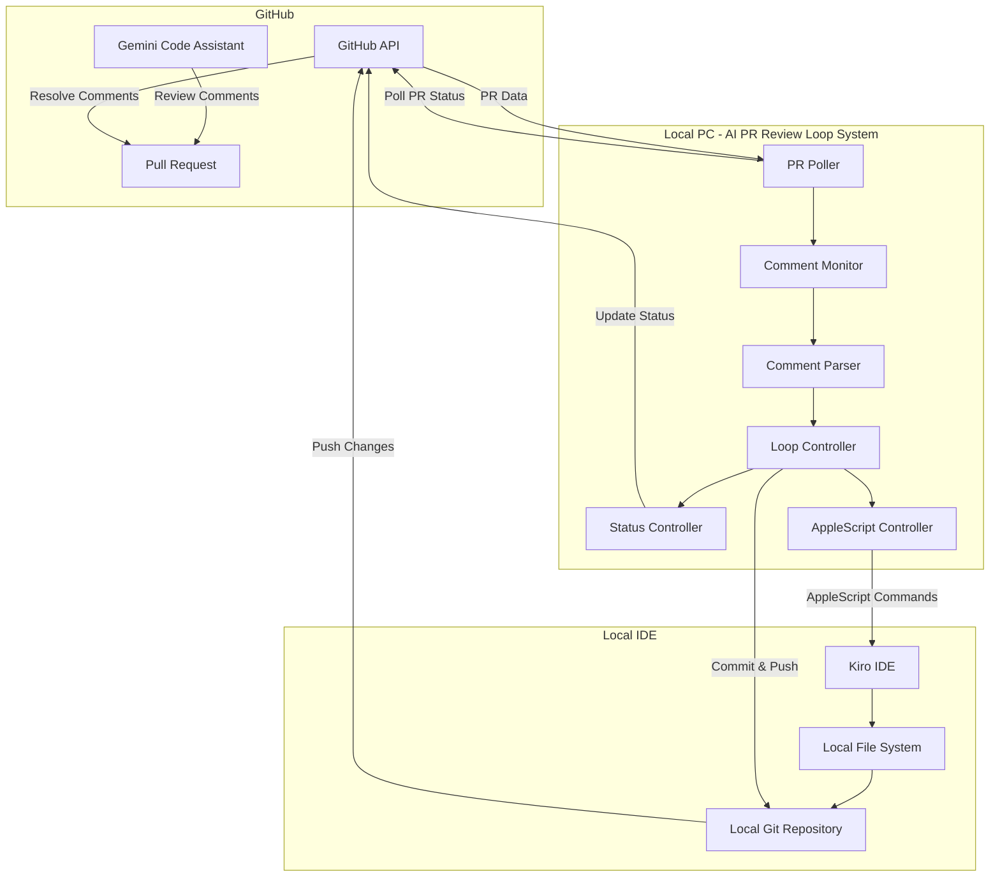

# 設計書

## 概要

GitHub PRの自動修正ループシステムは、ローカルPC上で動作し、GitHub APIを使用してGemini Code Assistのレビューコメントを定期的にポーリングで監視し、AppleScriptを通じてIDE（Kiro）を操作して自動修正を実行するシステムです。システムはローカルデーモンプロセスとして動作し、PRの状態変化に応じて適切なアクションを実行します。

## アーキテクチャ

### システム構成図



### データフロー

1. **PR監視**: 定期的にGitHub APIをポーリングしてPRの新しいコメントを検出
2. **コメント解析**: Gemini Code Assistのコメントから実行可能な提案を抽出
3. **IDE操作**: AppleScriptを使用してKiro IDEを操作し、コード変更を実行
4. **変更コミット**: ローカルGitリポジトリで修正内容をコミット・プッシュ
5. **コメント解決**: GitHub APIで修正完了したレビューコメントをresolve
6. **ループ制御**: 最大回数チェックと次のサイクル判定

## コンポーネントと インターフェース

### 1. PR Poller (PP)
**責務**: GitHub APIを定期的にポーリングしてPRの状態変化を監視

**インターフェース**:
```typescript
interface PRPoller {
  startPolling(prNumber: number, interval: number): void
  stopPolling(prNumber: number): void
  checkForNewComments(prNumber: number): Promise<Comment[]>
  getCurrentPRState(prNumber: number): Promise<PRState>
}
```

**主要機能**:
- 定期的なGitHub APIポーリング
- 新しいコメントの検出
- PR状態の変化監視
- レート制限の管理

### 2. Comment Monitor (CM)
**責務**: PRコメントの監視とGemini Code Assistコメントの識別

**インターフェース**:
```typescript
interface CommentMonitor {
  isGeminiComment(comment: Comment): boolean
  extractActionableComments(comments: Comment[]): ActionableComment[]
  trackCommentStatus(commentId: string, status: CommentStatus): void
}
```

**主要機能**:
- Gemini Code Assistコメントの識別
- 実行可能なコメントのフィルタリング
- コメント処理状況の追跡

### 3. Comment Parser (CP)
**責務**: レビューコメントの解析と修正指示の抽出

**インターフェース**:
```typescript
interface CommentParser {
  parseComment(comment: string): ParsedSuggestion[]
  extractFileChanges(suggestion: ParsedSuggestion): FileChange[]
  validateSuggestion(suggestion: ParsedSuggestion): boolean
}
```

**主要機能**:
- 自然言語の修正提案をstructured dataに変換
- ファイル変更指示の抽出
- 提案の実行可能性検証

### 4. Loop Controller (LC)
**責務**: レビュー・修正ループの制御と実行

**インターフェース**:
```typescript
interface LoopController {
  startLoop(prNumber: number): Promise<LoopSession>
  executeFixCycle(session: LoopSession, suggestions: ParsedSuggestion[]): Promise<FixResult>
  shouldContinueLoop(session: LoopSession): boolean
  finalizeLoop(session: LoopSession): Promise<void>
}
```

**主要機能**:
- ループセッション管理
- IDEエージェントとの連携
- 修正結果のコミット
- ループ継続判定

### 5. Status Controller (SC)
**責務**: PR上での進捗表示とステータス管理

**インターフェース**:
```typescript
interface StatusController {
  createStatusComment(prNumber: number): Promise<string>
  updateProgress(commentId: string, progress: LoopProgress): Promise<void>
  markCommentResolved(commentId: string): Promise<void>
  summarizeChanges(session: LoopSession): Promise<string>
}
```

**主要機能**:
- ステータスコメントの作成・更新
- 進捗の可視化
- レビューコメントの解決
- 変更サマリーの生成

### 6. AppleScript Controller (AS)
**責務**: AppleScriptを使用したKiro IDEの操作

**インターフェース**:
```typescript
interface AppleScriptController {
  openFile(filePath: string): Promise<boolean>
  navigateToLine(lineNumber: number): Promise<boolean>
  selectText(startLine: number, endLine: number): Promise<boolean>
  replaceSelectedText(newText: string): Promise<boolean>
  executeKiroCommand(command: string): Promise<string>
  saveFile(): Promise<boolean>
}
```

**主要機能**:
- Kiro IDEの起動・操作
- ファイルの開閉・編集
- テキスト選択・置換
- Kiroエージェント機能の実行
- AppleScriptエラーハンドリング

## データモデル

### Core Models

```typescript
// PRループセッション
interface LoopSession {
  prNumber: number
  iteration: number
  maxIterations: number
  startTime: Date
  status: 'running' | 'completed' | 'failed'
  processedComments: string[]
  appliedFixes: AppliedFix[]
}

// 解析済み提案
interface ParsedSuggestion {
  commentId: string
  type: 'code_change' | 'refactor' | 'bug_fix' | 'style_improvement'
  targetFile: string
  lineRange?: { start: number; end: number }
  description: string
  instruction: string
  confidence: number
}

// ファイル変更
interface FileChange {
  filePath: string
  changeType: 'modify' | 'create' | 'delete'
  content?: string
  lineChanges?: LineChange[]
}

// 適用済み修正
interface AppliedFix {
  suggestionId: string
  timestamp: Date
  success: boolean
  changes: FileChange[]
  commitHash?: string
  error?: string
}
```

## エラーハンドリング

### エラー分類と対応

1. **GitHub API エラー**
   - レート制限: 指数バックオフで再試行
   - 認証エラー: ログ出力してループ停止
   - ネットワークエラー: 3回まで再試行

2. **AppleScript エラー**
   - IDE未起動: Kiro IDEの自動起動試行
   - スクリプト実行エラー: 該当コメントをスキップ
   - ファイルアクセスエラー: エラーログ記録

3. **ローカルGit エラー**
   - コミット失敗: 変更の一時保存
   - プッシュ失敗: 再試行とコンフリクト検出
   - ブランチ切り替えエラー: 手動介入要求

4. **解析エラー**
   - コメント解析失敗: 該当コメントをスキップ
   - 不明確な指示: 手動レビューフラグ設定

### エラー通知

- 重要なエラーはPRコメントで通知
- 詳細ログはシステムログに記録
- 連続エラー時はループ自動停止

## テスト戦略

### 単体テスト
- 各コンポーネントの独立テスト
- モックを使用したAPI呼び出しテスト
- エラーケースの網羅的テスト

### 統合テスト
- GitHub API Polling → AppleScript → Git の完全フロー
- 実際のPRを使用したE2Eテスト
- 複数ループサイクルのテスト
- AppleScript実行の信頼性テスト

### パフォーマンステスト
- 大量コメント処理の負荷テスト
- 同時複数PR処理のテスト
- メモリリーク検証

### セキュリティテスト
- GitHub token権限テスト
- ローカルファイルアクセス権限テスト
- AppleScript実行権限テスト
- 入力値サニタイゼーションテスト